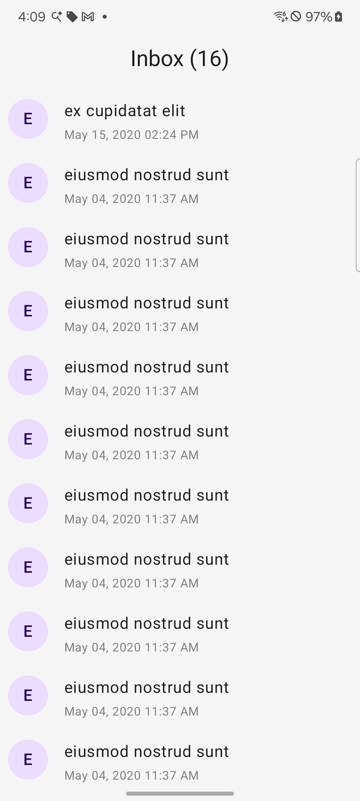
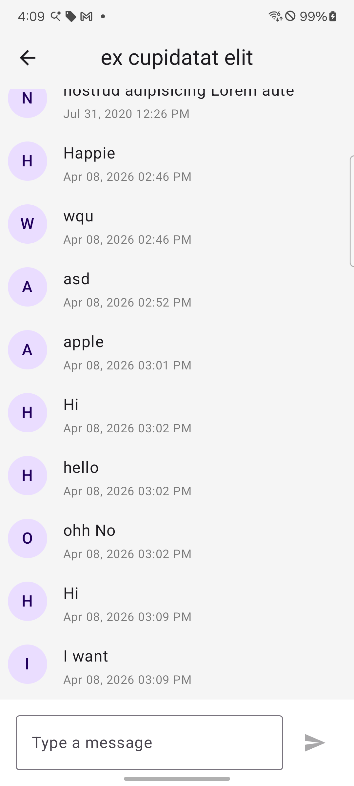
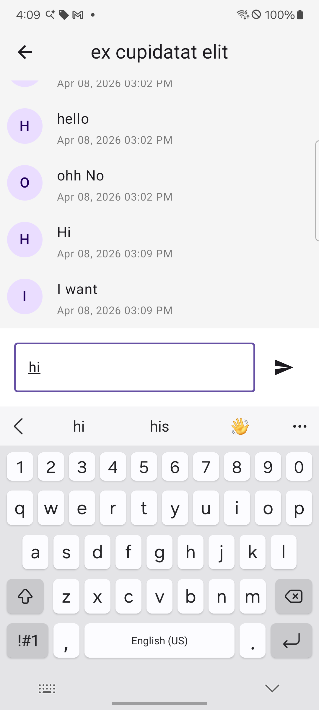
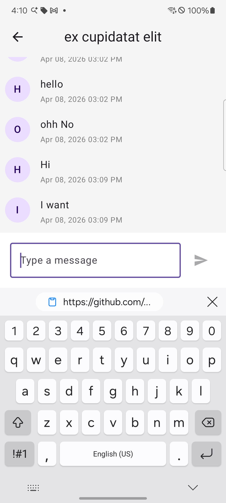

# Blink Chat - Android Application

A modern Android chat application built with Clean Architecture, Jetpack Compose, and Material 3.

## Tech Stack

| Layer | Technology |
|---|---|
| UI | Jetpack Compose, Material 3 |
| Architecture | Clean Architecture (Data / Domain / Presentation) |
| DI | Hilt |
| Database | Room |
| Serialization | Kotlin Serialization |
| Async | Coroutines, Flow |
| Navigation | Jetpack Navigation Compose |

## Features

- [x] View all conversations (Inbox)
- [x] View messages in a conversation
- [x] Send a message
- [x] Offline first (Room local cache)
- [x] Sync conversations from server
- [x] Scroll to bottom on keyboard open
- [x] Scroll to bottom on new message

### Features
- [ ] Show up SnackBar on message send failure.
- [ ] Show up empty state when there are no conversations or messages.
- [ ] Show up error state when fetching data from server.
- [ ] Support Dark, Light mode with Material 3 theming
- [ ] Integrate with backend API (e.g., Firebase, custom REST API)
- [ ] Integrate with WebSocket for real-time messaging
- [ ] Integrate the new message to Json file temporarily until backend is implemented
- [ ] Cleanup code, remove unused code and files, and refactor the codebase for better readability and maintainability.
- [ ] Add Makefile for build and run commands to simplify development workflow.
- [ ] Add unit tests for ViewModels and UseCases to ensure code quality and reliability.
- [ ] Bring up User model, and show sender, reciever and show UI, right and left based on the message owner
- [ ] Add animations for message sending, receiving, and scrolling to enhance user experience.
- [ ] Add pagination for conversations and messages to improve performance and user experience.

## Setup

1. Clone the repository
```bash
   git clone git@github.com:vimosanandev/BlinkChatApplication.git
```
2. Open in Android Studio
3. Sync Gradle
4. Run on emulator or device (min SDK 26)

## Architecture

This project follows Clean Architecture principles:

- **Data layer** — DTOs, Entities, DAOs, DataSources, Repository implementations
- **Domain layer** — Models, Repository interfaces, UseCases
- **Presentation layer** — ViewModels, UI State, Composables 

## Screenshots
| Inbox | Messages |
|---|---|
|  |  |
|  |  |

## License
This project is developed as a POC for showcasing the implementation of a chat application
using modern Android development practices in a short term.

© 2024 Vimosanandev. All rights reserved.